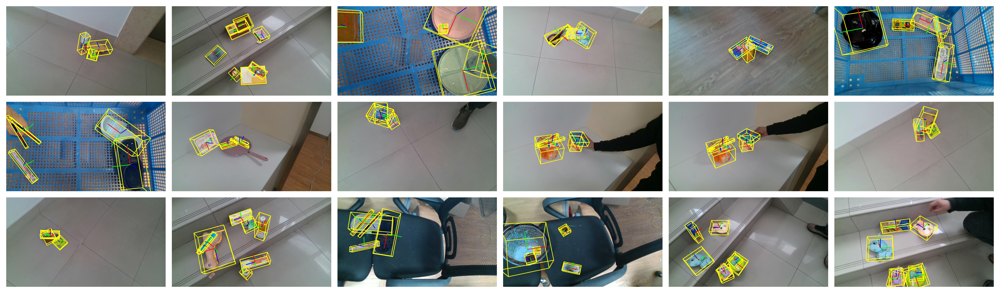
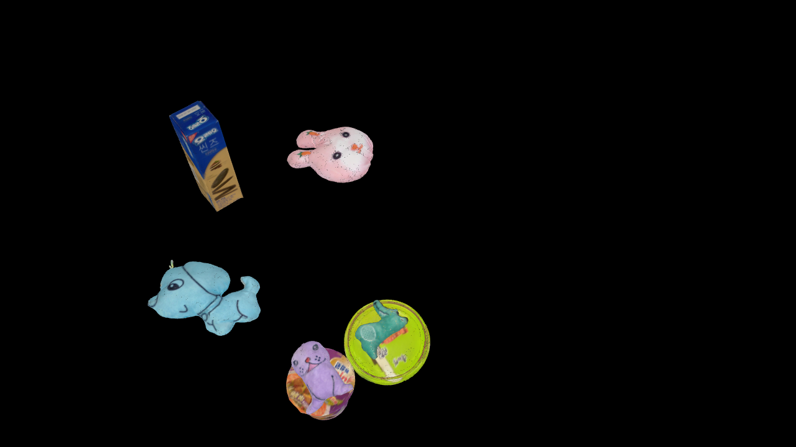
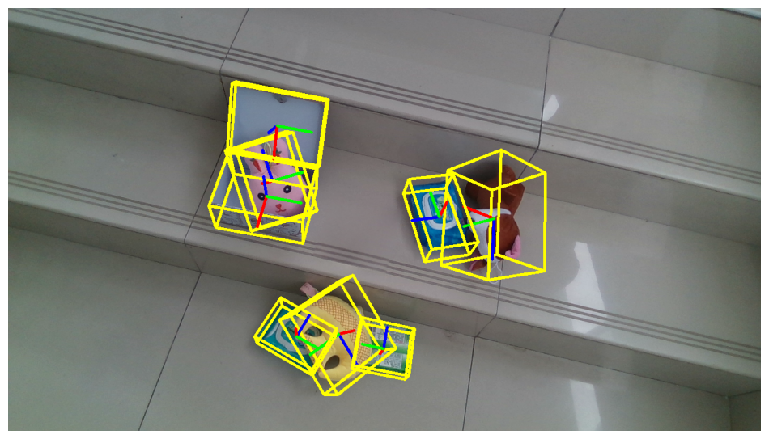
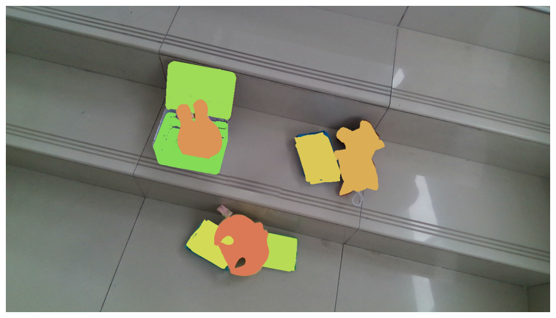
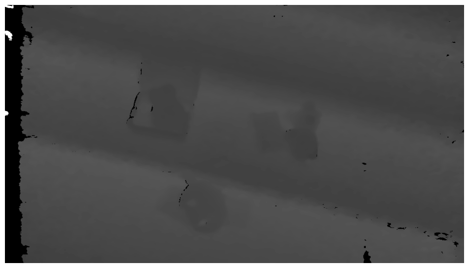
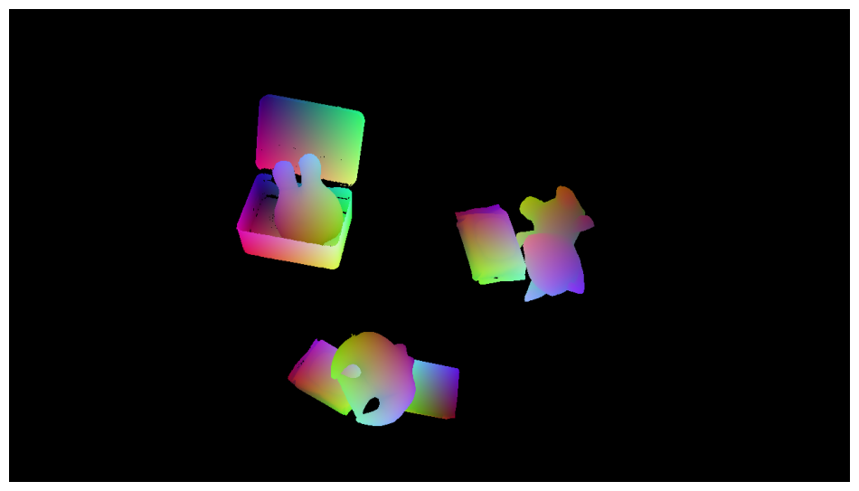

 <h1 align="center">
PACE: Pose Annotations in Cluttered Environments <br>
  (ECCV 2024)
</h1>

<p align='center'>
 </img>
</p>

<div align="center">
<h3>
<a href="https://qq456cvb.github.io">Yang You</a>, <a href="https://xiongkai.netlify.app/">Kai Xiong</a>, Zhening Yang, <a href="https://github.com/huangzhengxiang">Zhengxiang Huang</a>, <a href="https://github.com/Zhou-jw">Junwei Zhou</a>, <a href="https://rshi.top/">Ruoxi Shi</a>, Zhou Fang, <a href="https://adamharley.com/">Adam W Harley</a>, <a href="https://geometry.stanford.edu/member/guibas/">Leonidas Guibas</a>, <a href="https://www.mvig.org/">Cewu Lu</a>
<br>
<br>
<a href='https://arxiv.org/pdf/2312.15130.pdf'>
  
</a>
<a href='https://qq456cvb.github.io/projects/pace'>
  
</a>
<!-- <a href='https://youtu.be/IyGzkdR5MLU'>

</a> -->
<br>
</h3>
</div>
 
We introduce **PACE** (Pose Annotations in Cluttered Environments), a large-scale benchmark designed to advance the development and evaluation of pose estimation methods in cluttered scenarios. PACE provides a large-scale real-world benchmark for both instance-level and category-level settings. The benchmark consists of 55K frames with 258K annotations across 300 videos, covering 238 objects from 43 categories and featuring a mix of rigid and articulated items in cluttered scenes. To annotate the real-world data efficiently, we develop an innovative annotation system with a calibrated 3-camera setup. Additionally, we offer **PACESim**, which contains 100K photo-realistic simulated frames with 2.4M annotations across 931 objects. We test state-of-the-art algorithms in PACE along two tracks: pose estimation, and object pose tracking, revealing the benchmark’s challenges and research opportunities.

# Why a new dataset?
- Our objective is to rigorously assess the generalization capabilities of current state-of-the-art methods in a broad and challenging real-world environment. This will enable us to explore and quantify the 'simulation-to-reality' gap, providing deeper insights into the effectiveness of these methods in practical applications.

# Update Logs
- [2024/07/22] PACE dataset v1.1 uploaded to [HuggingFace](https://huggingface.co/datasets/qq456cvb/PACE/tree/main). Benchmark evaluation code released.
- [2024/03/01] PACE v1.0 released.

# Contents
- [Dataset Download](#dataset-download)
- [Dataset Format](#dataset-format)
- [Dataset Visualization](#dataset-visualization)
- [Benchmark Evaluation](#benchmark-evaluation)
- [Annotation Tools](#annotation-tools)
- [Citation](#citation)

# Dataset Download
Our dataset can be downloaded on [HuggingFace](https://huggingface.co/datasets/qq456cvb/PACE/tree/main). Please unzip all the `tar.gz` and place them under `dataset/pace` for evaluation. Large files are split into chunks, you can merge them with e.g., `cat test_chunk_* > test.tar.gz`.
  
# Dataset Format
Our dataset mainly follows [BOP format](https://github.com/thodan/bop_toolkit/blob/master/docs/bop_datasets_format.md) with the following structure with regex syntax:
```
camera_pbr.json
models(_eval|_nocs)?
├─ models_info.json
├─ (artic_info.json)?
├─ obj_${OBJ_ID}.ply
model_splits
├─ category
|  ├─ ${category}_(train|val|test).txt
|  ├─ (train|val|test).txt
├─ instance
|  ├─ (train|val|test).txt
(train(_pbr_cat|_pbr_inst)|val(_inst|_pbr_cat)|test)
├─ ${SCENE_ID}
│  ├─ scene_camera.json
│  ├─ scene_gt.json
│  ├─ scene_gt_info.json
│  ├─ scene_gt_coco_det_modal(_partcat|_inst)?.json
│  ├─ depth
│  ├─ mask
│  ├─ mask_visib
│  ├─ rgb
|  ├─ (rgb_nocs)?
```
- `camera_pbr.json` - Camera parameters for PBR rendering; camera parameters for real are saved per scene in `scene_camera.json`.
- `models(_eval|_nocs)?` - 3D object models. `models` contains the original scanned 3D models; `models_eval` contains uniformly sampled point cloud from the original meshes, and can be used for evaluation (e.g., computing chamfer distance). All models except articulated parts (ID `545` to ID `692`) are recentered and normalized within the unit bounding box. `models_nocs` contains the same 3D models with vertex recolored by NOCS coordinates.
  - `models_info.json` - Meta information about the meshes, including diameters (the largest distance between any two points), bounds and scales, all in mm. The scales represent the size of axis-aligned bounding boxes. This file also contains the mapping from `obj_id` (int) to object `identifier` (string). **Notice**: Each articulated object consists of multiple parts, where each part has a unique `obj_id`. The association information is stored in `artic_info.json`.
  - `artic_info.json` - It contains the part information of articulated objects, with `identifier` as the key.
  - obj_${OBJ_ID}.ply - Ply mesh files for `${OBJ_ID}`, e.g., `obj_000143.ply`.
- `model_splits` - It contains the model IDs used for train/val/test splits. For instance-level pose estimation, train and test share the same model IDs; for category-level pose estimation, train and test have different model IDs, and the split for each category is stored in `${category}_(train|val|test).txt`.
- `train(_pbr_cat|_pbr_inst)|val(_inst|_pbr_cat)|test` - For category-level training, we generate synthetic training and validation data under `train_pbr_cat` and `val_pbr_cat`; for instance-level training, we generate synthetic training data but use real validation data under `train_pbr_inst` and `val_inst`; both settings use real-world test data under `test`.
  - `${SCENE_ID}` - Each scene is placed in a separate folder, e.g., `000011`.
    - `scene_camera.json` - Camera parameters.
    - `scene_gt.json` - Ground-truth annotations. See [BOP format](https://github.com/thodan/bop_toolkit/blob/master/docs/bop_datasets_format.md#ground-truth-annotations) for details.
    - `scene_gt_info.json` - Meta information about ground-truth poses. See [BOP format](https://github.com/thodan/bop_toolkit/blob/master/docs/bop_datasets_format.md#meta-information-about-the-ground-truth-poses) for details.
    - `scene_gt_coco_det_modal(_partcat|_inst)?.json` - 2D bounding box and instance segmentation labels in COCO format.
      - `scene_gt_coco_det_modal_partcat.json` treats individual parts of articulated objects as different categories, which is useful when evaluating articulate-agnostic category-level pose estimation methods.
      - `scene_gt_coco_det_modal_inst.json` treats each object **instance** as a separate category, which is useful when evaluating instance-level pose estimation methods. **Notice**: there are slightly more categories than those reported in the paper since some objects only appear in the synthetic dataset but not in the real one.
    - `rgb` - Color images.
    - `rgb_nocs` - Normalized coordinates of objects encoded as RGB colors (mapped from `[-1, 1]` to `[0, 1]`). It is normalized w.r.t the objects bounding box, e.g.,
      ```
      mesh = trimesh.load_mesh(ply_fn)
      bbox = mesh.bounds
      center = (bbox[0] + bbox[1]) / 2
      mesh.apply_translation(-center)
      extent = bbox[1] - bbox[0]
      colors = np.array(mesh.vertices) / extent.max()
      colors = np.clip(colors + 0.5, 0, 1.)
      ```
    - `depth` - Depth images (saved as 16-bit unsigned short). To convert depth into actual meters, divide by 10000 for PBR renderings and 1000 for real.
    - `mask` - Masks of objects.
    - `mask_visib` - Masks of visible parts of objects.


# Dataset Visualization
We provide a visualization script to visualize the ground-truth pose annotations together wich their rendered 3D models. You can run `visualizer.ipynb` and get the following rgb/rendering/pose/mask visualizations:

<p align='center'>
 </img>  </img>
</p>
<p align='center'>
 </img>  </img>
</p>

<p align='center'>
 </img>  </img>
</p>

# Benchmark Evaluation
Unzip all the `tar.gz` from [HuggingFace](https://huggingface.co/datasets/qq456cvb/PACE/tree/main) and place them under `dataset/pace` in order for evaluation.

## Instance-Level Pose Estimation
To evaluate instance-level pose estimation, please make sure you cloned the submodule of our fork of `bop_toolkit`. You can do this after `git clone` with `git submodule update --init`, or alternatively do `git clone --recurse-submodules git@github.com:qq456cvb/PACE.git`. 

Put the prediction results under `prediction/instance/${METHOD_NAME}_pace-test.csv` (you can download baseline resuts them from [Google Drive](https://drive.google.com/drive/folders/1_MfVn815u0oWzGG4H9bcRIy42rVLzOr0?usp=sharing)). Then run the following commands:
```
cd eval/instance
sh eval.sh ${METHOD_NAME}
```

## Category-Level Pose Estimation
Put the prediction results under `prediction/category/${METHOD_NAME}_pred.pkl` (you can download baseline resuts them from [Google Drive](https://drive.google.com/drive/folders/1_Z22KjGJ55yimboSuN2nVp6M0_Yz1-Dr?usp=sharing)). We also convert the ground-truth labels into a compatible `pkl` format, where you can download from [here](https://drive.google.com/file/d/1a_Ld_8COxQAXL2dJI4L2qvrwbpX6qsa2/view?usp=sharing) and put it under `eval/category/catpose_gts_test.pkl`. Then run the following commands:
```
cd eval/category
sh eval.sh ${METHOD_NAME}
```

**Note**: You may find more categories (55) in `category_names.txt` than that reported in the paper. This is because, some categories don't have corresponding real-world test images but only a set of 3D models, so we drop them. The actual categories (47) for evaluation is stored in `category_names_test.txt` (parts are counted as separate categories). Ground-truth class ids in `catpose_gts_test.pkl` still use the index from 1 to 55 corresponding to `category_names.txt`.


# Annotation Tools
We also provide the source code of our annotation tools, organized as follows:
```
annotation_tool
├─ inpainting
├─ obj_align
├─ obj_sym
├─ pose_annotate
├─ postprocessing
├─ TFT_vs_Fund
├─ utils
```

- `inpainting` - Code for inpainting the markers so that the result image is more realistic.
- `obj_align` - Code for aligning objects into a consistent orientation within the same category.
- `obj_sym` - Code for annotating object symmetry information.
- `pose_annotate` - The main program of pose annotation.
- `postprocessing` - Code for various post processing steps, e.g., remove the markers, automatically refine the extrinsics, and manually align the extrinsics.
- `TFT_vs_Fund` - Used in refining the extrinsics of the 3-cameras.
- `utils` - Miscellaneous help functions.

More detailed documentation for the annotation software is coming soon. We are cleaning the code and try our best to make it convenient for the community to annotate 3D object poses accurately.

# Licenses
[MIT](https://opensource.org/license/mit) license for all contents, **except**:

Our models with ID from `693` to `1260` are grabbed from [SketchFab](https://sketchfab.com/) with [CC BY](https://creativecommons.org/licenses/by/4.0/) license, with credit given to the model creators. You can find the original posts of these models on `https://sketchfab.com/3d-models/${OBJ_IDENTIFIER}`, where the identifier can be found in the second component (separated by `/`) of key `identifier` in `models_info.json`. 

Models with ID `1165` and `1166` are grabed from [GrabCAD](https://grabcad.com/library/squeegee-2) (these two share the same geometry but different colors). For these two models, please see [the license from GrabCAD](https://help.grabcad.com/article/246-how-can-models-be-used-and-shared?locale=en).

# Citation
```
@misc{you2023pace,
    title={PACE: Pose Annotations in Cluttered Environments},
    author={You, Yang and Xiong, Kai and Yang, Zhening and Huang, Zhengxiang and Zhou, Junwei and Shi, Ruoxi and Fang, Zhou and Harley, Adam W. and Guibas, Leonidas and Lu, Cewu},
    booktitle={European Conference on Computer Vision},
    year={2024},
    organization={Springer}
}
```
